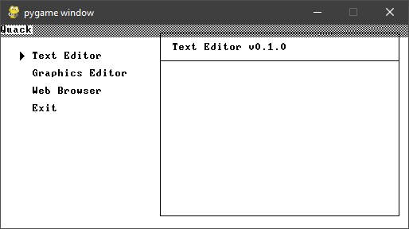

# Quack

An extension of the Jack operating system (from the
[nand2tetris](https://nand2tetris.org) course).



## Build

For the compilation, translation and assembling of Jack programs, you
need [Python](https://www.python.org/downloads/).

For the CPU emulator, you need pygame.

```
pip3 install pygame
```

Build and run the project using `run.bat` (Windows) or `run.sh` (Ubuntu).

What the build script does:
- Compiles the `*.jack` files in `kernel/` and `userland/` directories.
- Copies the VM files to the `build/` directory.
- Translates the compiled VM code to Hack assembly. `build/out.asm`
- Assembles the Hack assembly code to machine code. `build/out.hack`
- Runs the machine code on the CPU emulator.

## Docs

* **[Introduction](docs/introduction.md)**
* **[Architecture](docs/architecture.md)**
* **[Memory Layout](docs/memory-layout.md)**
* **[Interrupts](docs/interrupts.md)**


## Todo

Applications

- [ ] Text Editor
- [ ] GUI Toolkit
- [ ] Japanese Font
- [ ] Splash Screen
- [ ] Blinking Cursor
- [ ] Animated Sprites
- [ ] Chip8 Interpreter
- [ ] Graphics Editor
- [ ] Web Browser

Language

- [ ] Hex numbers
- [ ] Code coverage
- [x] XOR operations
- [ ] Inline assembly
- [ ] Shift operations
- [ ] Coding style guide

System

- [ ] File System
- [ ] C++ Emulator
- [ ] Sound Support
- [ ] Network Stack
- [ ] Timer Interrupts
- [ ] Keyboard Interrupts
- [ ] Hardware-based CPU emulator

Misc.

- [ ] Terminate compiler and batch script on error.
- [ ] Check if Hack file is 64-bit before emulating.
- [ ] Print string and newline in the same function.
- [ ] Implement special keyboard input. (backspace, control, etc.)
- [ ] Output multiple files from assembler; concat them in the build script.
- [ ] While updating screen, check if it is already set and then don't update.