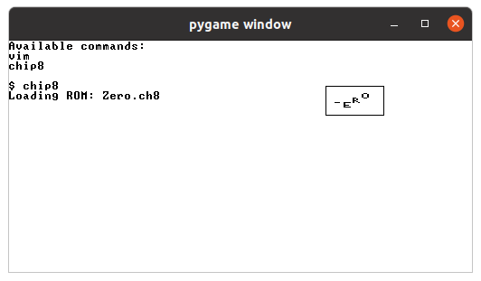

# Genesis

Minimal OS written in Jack.



## Build

Tested on Ubuntu 20.04.

Clone the repository.

```
git clone https://github.com/abhaynayar/genesis
```

For the compilation, translation and assembling of Jack programs, you need
[Python](https://www.python.org/downloads/).

For the CPU emulator, you need
[pygame](https://www.pygame.org/).

Build and run the project using:

```
./run.sh
```

What the build script does:
- Compiles the `*.jack` files in `kernel/` and `userland/` directories.
- Copies the VM files to the `build/` directory.
- Translates the compiled VM code to Hack assembly. `build/out.asm`
- Assembles the Hack assembly code to machine code. `build/out.hack`
- Runs the machine code on the CPU emulator.

## Docs

* **[Introduction](docs/introduction.md)**
* **[Architecture](docs/architecture.md)**
* **[Memory Layout](docs/memory-layout.md)**
* **[Interrupts](docs/interrupts.md)**
* **[File System](docs/file-system.md)**

## Todo

Applications

- [ ] Text Editor.
	- SHIFT key support.
	- Fix backspace quirks.
	- Hold key for multi-input.
- [x] Chip8 Interpreter.
- [ ] GUI Toolkit.

Language

- [ ] For loops.
- [ ] Hex numbers.
- [ ] If-else ladders.
- [ ] Shift operations.
- [ ] Switch statements.
- [ ] Declare variables anywhere.
- [ ] Code coverage.
- [ ] Error handling.
- [ ] Inline assembly.
- [ ] Coding style guide.
- [x] Modulo operator.
- [x] XOR operations.

System

- [ ] File System.
- [x] C++ Emulator.
- [ ] Sound Support.
- [ ] Network Stack.
- [ ] Timer Interrupts.
- [ ] Shell Text Buffer.
- [ ] Keyboard Interrupts.
- [x] Hardware-based CPU emulator. (n2t-wasm)

Misc.

- [ ] Fonts with transparent backgrounds.
- [ ] Terminate compiler and shell script on error.
- [ ] Check if Hack file is 64-bit before emulating.
- [ ] Print string and newline in the same function.
- [ ] Check if pixel is already set, if yes then don't update.
- [ ] Output multiple files from assembler; concat them in the build script.
- [x] Why does XOR only work with a space? => Was not added in JackType.symbols[].
